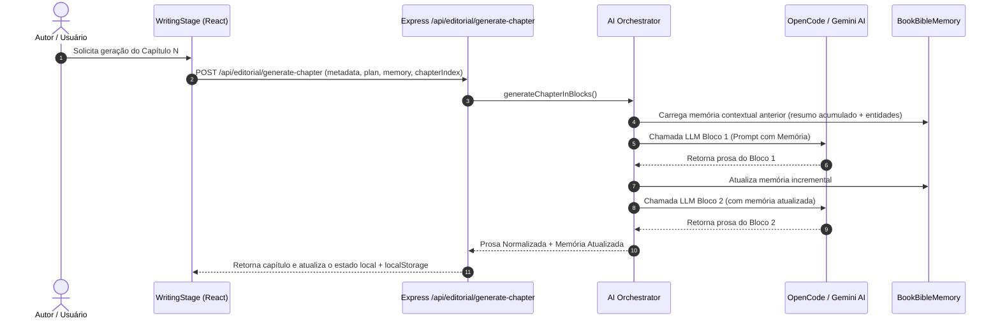
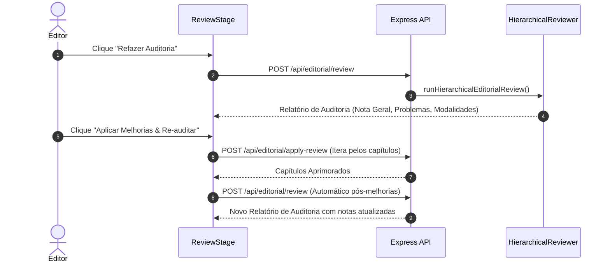

# ARCHITECTURE.md - Documentação Arquitetural do OMNIA FACTORY

## 1. Visão Geral da Arquitetura

O **OMNIA FACTORY (v2.5.0)** é uma plataforma enterprise para automação do ciclo editorial de livros, cobrindo planejamento estrutural, redação continuada por blocos com memória contextual, auditoria hierárquica e diagramação/exportação em PDF/EPUB.

A aplicação adota uma arquitetura **Full-Stack Monolítica Decoplada**:
- **Frontend (Client)**: Single Page Application (SPA) construída com React 19, Vite 6, TailwindCSS 4 e Lucide Icons.
- **Backend (Server)**: Servidor Node.js 20+ com Express 4, atuando como API Gateway, Orquestrador de IA de baixa latência e motor de geração de mídia via Puppeteer.

```mermaid
graph TD
    Client[React 19 SPA / Browser] -->|REST API / JSON| Express[Express 4 Server (Port 3000)]
    Express -->|Rate Limit & Security Auth| Sec[Helmet / RateLimiter / Bearer Auth]
    Sec -->|Orchestration| Orchestrator[AI Orchestrator Engine]
    Orchestrator -->|Primary API| Gemini[Google Gemini API (@google/genai)]
    Orchestrator -->|Fallback / Rotation| OpenCode[OpenCode Gateway Router]
    Express -->|Puppeteer Headless| PDFEngine[Puppeteer PDF Generator]
    Express -->|Base64 Data URIs| CoverEngine[Canvas SVG Cover Engine]
```

---

## 2. Fluxos de Dados Principais

### 2.1 Fluxo de Redação Sequencial com Memória Histórica (Book Bible Memory)



### 2.2 Fluxo de Auditoria e Re-auditoria Automática Pós-Melhoria



---

## 3. Modelo de Domínio e Tipos de Dados Vitais

### 3.1 Entidades Principais (`src/types.ts`)

- **`BookProject`**: A raiz de agregação do livro contendo `metadata`, `plan`, `chapters`, `frontMatter`, `endMatter`, `editorialReport` e `chapterVersions`.
- **`BookMetadata`**: Configurações de título, subtítulo, autor, editora, estilo, tom, resumo, público-alvo, público, restrições e materiais de apoio.
- **`EditorialPlan`**: Estrutura do livro, composta por tese central, tom geral, conceito visual e `sumario` (`ChapterPlan[]`).
- **`ChapterContent`**: Estado do capítulo (`numero`, `titulo`, `content`, `wordCount`, `status`).
- **`EditorialReport`**: Resultado da auditoria hierárquica contendo `notaGeral`, `coberturaTotalUnidadesPercent`, `pontosFortes`, `sugestoesGlobais`, `modalidades` e `problemasDetectados`.

---

## 4. Architecture Decision Records (ADRs)

### ADR 001: Integração Monolítica Decoplada (Vite Middleware + Express)
- **Status**: Aceito.
- **Contexto**: O sistema precisa rodar tanto em ambiente local simples (`npm run dev`) quanto empacotado para produção.
- **Decisão**: Usar Express como servidor principal. Em desenvolvimento, o Vite é injetado como middleware (`vite.createServer`). Em produção, a aplicação cliente é compilada em arquivos estáticos (`dist/`) e servida pelo Express, enquanto o servidor `server.ts` é empacotado com `esbuild` em `dist/server.cjs`.
- **Consequência**: Onboarding extremamente simples e deploys em contêiner sem complexidade de múltiplos serviços.

### ADR 002: Rotação Multi-Key Round-Robin & Failover Incondicional no OpenCode Provider
- **Status**: Aceito.
- **Contexto**: Limites de rate-limit e quota em chaves de API podem interromper a geração de e-books longos.
- **Decisão**: Implementar em `openCodeProvider.ts` o parseamento de array de chaves (`resolveApiKeys`) lidas de `process.env.OPENCODE_API_KEY` (separadas por vírgula) com rotação round-robin global (`globalKeyIndex`) e retentativas automáticas chave-a-chave.
- **Consequência**: Tolerância a falhas superior e consumo distribuído de cota.

### ADR 003: Exportação Puppeteer Print-to-PDF com Footers Dinâmicos
- **Status**: Aceito.
- **Contexto**: O PDF gerado precisa seguir padrões gráficos profissionais de gráfica (rodapé com nome do livro no canto inferior esquerdo e número da página no canto inferior direito).
- **Decisão**: Utilizar o Puppeteer em modo headless com injeção de CSS Paged Media (`@page`), injeção de atributo `data-book-title` nos elementos `.page-sheet` e personalização do template nativo de rodapé do Chromium (`footerTemplate` com `<span class="pageNumber"></span>`).
- **Consequência**: Fidelidade visual idêntica à impressão física.

### ADR 004: Re-auditoria Automática Pós-Aplicação de Melhorias
- **Status**: Aceito.
- **Contexto**: O usuário precisa saber se as correções sugeridas pela IA realmente resolveram as inconsistências detectadas.
- **Decisão**: Encadear a chamada de `handleRunReview()` automaticamente dentro de `handleApplyReviewImprovements()` assim que a reescrita for finalizada.
- **Consequência**: Validação imediata sem necessidade de intervenção manual.

---

## 5. Fronteiras de Segurança e Políticas de Proteção

1. **Autenticação por Bearer Token (`API_ACCESS_TOKEN`)**: Opcional em dev, obrigatório para produção se o endpoint for exposto publicamente.
2. **Rate Limiting em Camadas**:
   - `/api/`: Limite global de 100 requisições / 15min por IP.
   - `/api/editorial/`: Limite estrito de 20 requisições / 15min por IP para prevenir estouro de cota e ataques de DoS financeiro.
3. **Limites de Payload**: `express.json({ limit: '50mb' })` para permitir backups completos do projeto e imagens base4 de capa, tratado com captura de erro HTTP 413.
