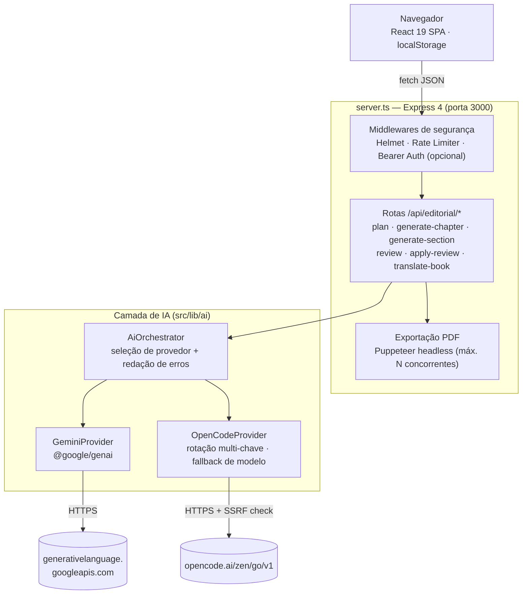

# OMNIA Factory


**Estúdio editorial orientado a IA** para planejamento, redação contínua por blocos, auditoria hierárquica e diagramação profissional (PDF/EPUB/HTML) de livros — do rascunho ao arquivo pronto para publicação.

> Documentação relacionada: [`ARCHITECTURE.md`](./ARCHITECTURE.md) (fluxos de dados, ADRs, diagramas de sequência) · [`CONTRIBUTING.md`](./CONTRIBUTING.md) (padrão de commits, fluxo de PR) · [`llms.txt`](./llms.txt) / [`llms-full.txt`](./llms-full.txt) (contexto para agentes de IA) · [`.cursorrules`](./.cursorrules) (regras operacionais para agentes).

---

## Visão geral

A aplicação conduz um livro por 5 etapas — **Configuração → Planejamento → Redação → Revisão → Diagramação/Exportação** — orquestrando chamadas de IA (Gemini ou OpenCode) para gerar o plano editorial, escrever capítulos em blocos com memória de continuidade (*BookBible Memory*), auditar a obra unidade por unidade, e exportar em PDF (via Puppeteer), EPUB 3 e HTML.

É um monólito full-stack: um único servidor Express serve tanto a API quanto o front-end React (via middleware do Vite em desenvolvimento, ou arquivos estáticos empacotados em produção). Não há banco de dados — o estado do projeto vive no `localStorage` do navegador, com backup/restauração via arquivo JSON.

## Arquitetura em um relance



Para os fluxos de sequência detalhados (redação em blocos com memória, auditoria + re-auditoria automática) e os *Architecture Decision Records*, veja [`ARCHITECTURE.md`](./ARCHITECTURE.md).

## Pré-requisitos

- **Node.js ≥ 20** (o `package.json` declara `engines.node: ">=20"`; testado em Node 22)
- **npm 10+** (o repositório versiona `package-lock.json` — use `npm ci` em CI/produção)
- Uma chave de API de pelo menos um provedor de IA: **Gemini** ([Google AI Studio](https://aistudio.google.com/apikey)) e/ou **OpenCode GO**
- Nenhum banco de dados ou serviço externo além das APIs de IA é necessário

## Instalação rápida

```bash
git clone https://github.com/pjsghf/OMNIA-FACTORY.git
cd OMNIA-FACTORY
npm install

cp .env.example .env
# edite .env e defina GEMINI_API_KEY e/ou OPENCODE_API_KEY

npm run dev
# abre em http://localhost:3000
```

Para produção:

```bash
npm run build   # compila o cliente (Vite) e empacota o servidor (esbuild -> dist/server.cjs)
npm start       # NODE_ENV=production node dist/server.cjs
```

### Verificando os provedores de IA

A suíte de testes automatizados **não** faz chamadas reais a nenhum provedor (propositalmente — custo e determinismo). Depois de configurar as chaves, confirme que elas realmente funcionam:

```bash
npm run verify:providers
```

| Código de saída | Significado |
|---|---|
| `0` | Tudo que está configurado foi alcançado e respondeu corretamente |
| `1` | Algo configurado está genuinamente quebrado — leia a saída |
| `2` | **Inconclusivo** (nenhuma chave configurada, ou rede bloqueando o host) — não é aprovação |

## Variáveis de ambiente

Todas em `.env.example`. Nenhuma é obrigatória para o servidor *subir*, mas sem pelo menos uma chave de IA nenhuma geração funciona.

| Variável | Obrigatória | Descrição |
|---|---|---|
| `PORT` | Não (padrão `3000`) | Porta HTTP do servidor Express. |
| `NODE_ENV` | Não | `development` usa o Vite como middleware; `production` serve `dist/` estático. |
| `GEMINI_API_KEY` | Não* | Chave server-side do Google Gemini. Nunca prefixe com `VITE_` (vazaria para o bundle do cliente). |
| `OPENCODE_API_KEY` | Não* | Chave do OpenCode GO. Aceita múltiplas chaves separadas por espaço, vírgula ou ponto e vírgula, para rotação round-robin com failover. |
| `OPENCODE_EXTRA_MODELS` | Não | IDs de modelo OpenCode adicionais, além do catálogo embutido (separados por vírgula). Use quando o gateway expõe um modelo que o catálogo ainda não lista. |
| `API_ACCESS_TOKEN` | Não | Se definida, exige `Authorization: Bearer <token>` (ou header `X-API-Key`) em toda a superfície `/api/*`, exceto `/api/health`, `/api/ready` e `/api/privacy-policy`. **Defina antes de expor o servidor publicamente** — sem isso, qualquer pessoa com a URL gasta a sua cota de IA. |
| `FRAME_ANCESTORS` | Não | Origens adicionais autorizadas a incorporar a aplicação em `<iframe>` (CSP `frame-ancestors`). |
| `EXTRA_CONNECT_SRC` | Não | Origens adicionais que o navegador pode contatar via `fetch` (CSP `connect-src`). |

\* Pelo menos uma das duas é necessária para qualquer funcionalidade de IA (planejamento, redação, revisão, tradução). A geração de capa faz *fallback* automático para um compositor SVG vetorial quando o Gemini não está configurado.

## Scripts disponíveis

```bash
npm run dev              # servidor de desenvolvimento (Vite middleware + Express)
npm run build             # build de produção (cliente + servidor)
npm start                  # roda o build de produção
npm run typecheck          # tsc --noEmit
npm run typecheck:strict   # tsc --noEmit com noUncheckedIndexedAccess e afins
npm run lint                # eslint .
npm run format:check        # prettier --check
npm test                     # suíte completa (vitest)
npm run test:unit            # apenas tests/unit
npm run test:integration     # apenas tests/integration
npm run test:security        # apenas tests/security
npm run test:exports         # apenas tests/exports (EPUB/PDF)
npm run test:coverage        # suíte completa + relatório de cobertura
npm run verify:providers     # chamadas reais e mínimas aos provedores de IA configurados
```

## Solução de problemas (Troubleshooting)

**`npm run verify:providers` retorna `SKIP` / código de saída `2` para o OpenCode, mencionando "Host not in allowlist"**
Isso é um proxy de rede bloqueando a conexão de saída, não uma credencial inválida — o script diferencia deliberadamente os dois casos (um proxy que recusa o `CONNECT` também responde `403`, o que seria fácil de confundir com "chave rejeitada pelo provedor"). Rode o script fora do ambiente restrito (localmente, ou num CI sem egress bloqueado).

**A geração de texto falha imediatamente com `MODEL_NOT_ALLOWED` ou "não é permitido"**
O modelo padrão (`gemini-2.5-flash` / `deepseek-v4-flash`, ver `src/lib/ai/catalog.ts`) precisa existir na sua conta/gateway. Rode `npm run verify:providers` — ele lista os modelos reais disponíveis via `GET /v1beta/models` (Gemini) e testa uma chamada mínima (OpenCode). Um modelo do OpenCode fora do catálogo embutido precisa estar em `OPENCODE_EXTRA_MODELS`.

**Exportação de PDF retorna `503 PDF_EXPORT_BUSY`**
O servidor limita exportações de PDF simultâneas (Puppeteer sobe um Chromium inteiro por requisição). O padrão é 2 (`MAX_CONCURRENT_PDF_EXPORTS`); ajuste essa variável de ambiente se o host tiver memória de sobra, ou tente novamente em alguns segundos.

**Erro de armazenamento local / obra "sumiu"**
O app salva projetos no `localStorage` do navegador (com debounce), não em servidor. Se aparecer um aviso de falha ao salvar (cota do navegador esgotada, modo anônimo/privado), **exporte um backup imediatamente** (Biblioteca de Projetos → Backup) antes de fechar a aba — é o único jeito de não perder o trabalho nesse cenário.

**`npm run build` funciona mas `npm start` falha ao gerar PDF**
O Puppeteer baixa um binário do Chromium na instalação (`npm install`); confirme que essa etapa não foi pulada (`--ignore-scripts`) e que o host tem as dependências de sistema do Chromium (em imagens Docker minimalistas, isso costuma faltar — veja a imagem oficial do Puppeteer ou instale as libs do Chromium manualmente).

**Erros de tipo aparecem só em `typecheck:strict`, não em `typecheck`**
Isso é esperado e é o propósito de ter os dois scripts: `tsconfig.strict.json` liga `noUncheckedIndexedAccess` e outras checagens que `tsconfig.json` não tem. O CI roda ambos; um código que passa em `typecheck` mas falha em `typecheck:strict` deve ser corrigido, não silenciado.

**Alterações não aparecem no GitHub / branch errada**
Este projeto usa Pull Requests como gate de CI — commits diretos em `main` pulam a verificação automática (typecheck, lint, testes, build) até o momento do push, o que já causou pelo menos um build quebrado sem que ninguém notasse por várias execuções seguidas. Prefira sempre branch + PR, mesmo trabalhando sozinho; veja [`CONTRIBUTING.md`](./CONTRIBUTING.md).

## Estrutura do projeto

```
src/
├── lib/
│   ├── ai/                  # Orquestração de IA, prompts, geração em blocos, revisão hierárquica
│   │   ├── providers/       # GeminiProvider, OpenCodeProvider (rotação multi-chave)
│   │   ├── generation/      # Geração sequencial de capítulos e seções pré/pós-textuais
│   │   ├── memory/          # BookBible: memória de continuidade entre capítulos
│   │   ├── review/          # Auditoria hierárquica map-reduce + re-auditoria automática
│   │   └── validation/      # Validação de config, conteúdo, cobertura, reconciliação de plano
│   ├── security/             # Headers CSP, rate limiting, autenticação opcional por token
│   ├── pdf/                   # Motor de exportação PDF via Puppeteer + CSS Paged Media
│   ├── rendering/              # AST editorial unificado (Markdown -> HTML/XHTML/MD)
│   └── validation/              # Gate de prontidão para publicação (preflight)
├── components/                   # Telas React por etapa do pipeline editorial
└── App.tsx                        # Estado raiz da SPA e orquestração entre etapas

server.ts       # Servidor Express: rotas de API, segurança, exportação PDF
scripts/        # Scripts utilitários (verify:providers)
tests/          # Suítes vitest: unit, integration, security, exports, components
```

---

<p align="center"><sub>OMNIA Factory · Editora OMNIA</sub></p>
